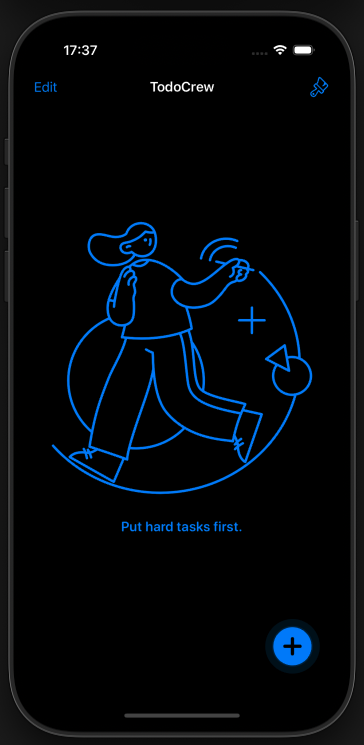
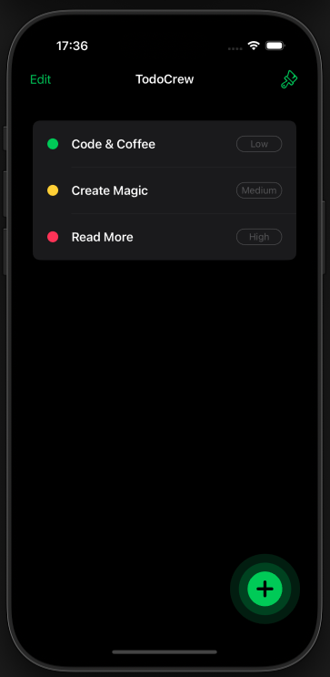
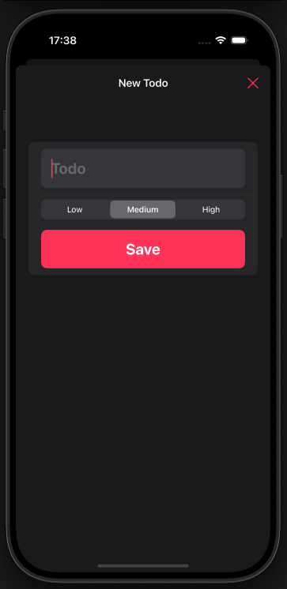
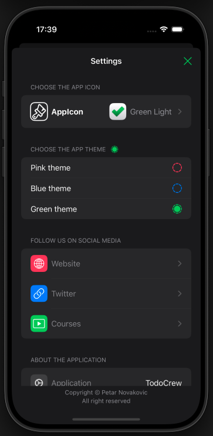

# ToDoCrew
ToDoCrew iOS app covering:

  -  SwiftUI – Declarative UI framework for building modern iOS apps.
  -  Core Data – Framework for local data persistence and management.
  -  MVVM Architecture – Clean separation of concerns between UI and business logic.
  -  E2E Testing – Validating the entire app flow from start to finish.
  -  Mocking – Simulating network responses for testing.
  -  Dependency Injection – Improving testability and modularity.
  -  Continuous Integration (CI) – Automating builds and tests.
  -  GitHub Actions – CI/CD pipeline for automatic testing.
  -  iPad Support – Optimized UI and layout adjustments for larger screens.
  -  SwiftUI Animations – Smooth and elegant animation effects.
  -  Adaptive Appearance – Seamless transition between dark and light modes.
  -  Custom Themes – Personalized app with unique selectable color schemes.
  -  App Icon Customization – Choose your favorite icon to match your style.
  -  Localization – Supporting multiple languages with Localizable.strings.

📌 Note: No external dependencies – Just download and run.

📸 Screenshots

<table>
  <tr>
    <td></td>
    <td></td>
    <td></td>
    <td></td>
  </tr>
</table>
